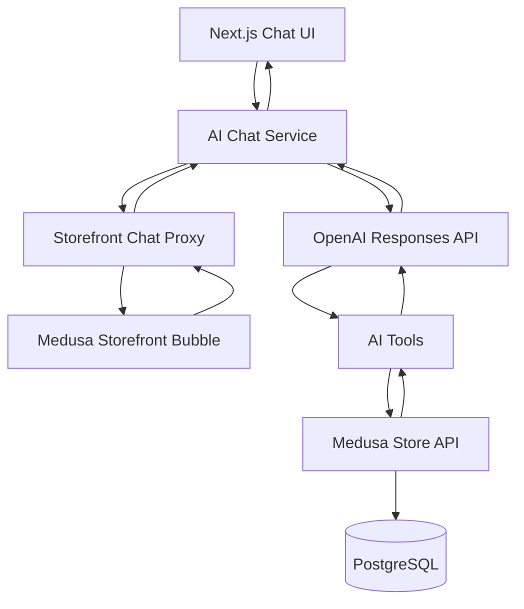

# 2Agize AI Assistant

Standalone multilingual AI chatbot for the 2Agize B2B commerce proof of concept.

The assistant understands English, Swahili / Kiswahili, mixed language, and typos. It never queries PostgreSQL. Business data comes from Medusa Store APIs through a tool layer, so Medusa can later be replaced by 2Agize APIs without rewriting the AI layer.

## Architecture



```text
Customer on Medusa storefront
        ↓
Floating bubble (storefront UI)
        ↓
POST /api/assistant/chat  (Next.js proxy, attaches httpOnly JWT)
        ↓
POST /api/chat            (AI service)
        ↓
OpenAI tool calling
        ↓
Medusa Store APIs
        ↓
Natural-language answer
```

The Medusa backend is not modified. The storefront only hosts the bubble and a thin proxy. The customer JWT cookie `_medusa_jwt` is httpOnly, so a cross-origin iframe cannot read it. The proxy forwards `Authorization: Bearer <token>` to the AI service. The model never chooses `customerId`.

## Prerequisites

- Node.js 20+
- A running Medusa B2B backend (this workspace uses [Medusa 2.17.0](https://github.com/medusajs/medusa) from `D:\b2b-starter-main\b2b-starter-main`)
- OpenAI API key with access to the Responses API
- The storefront publishable API key

## Installation

```bash
cd D:\2Agize_AIChatBot
npm install
cd frontend
npm install
```

## Environment variables

Copy `.env.example` to `.env` in the project root.

| Variable | Purpose |
|---|---|
| `OPENAI_API_KEY` | OpenAI secret. Never commit this. |
| `OPENAI_MODEL` | Model name, for example `gpt-4o` |
| `MEDUSA_BACKEND_URL` | Medusa server URL |
| `MEDUSA_PUBLISHABLE_KEY` | Store publishable key (`pk_...`) |
| `MEDUSA_REGION_ID` | Optional. If empty, the service picks a TZS region or the first region |
| `PORT` | AI service port, default `3001` |
| `FRONTEND_ORIGIN` | CORS origin for the standalone Next.js UI |
| `STOREFRONT_ORIGIN` | CORS origin for the Medusa storefront |

This Medusa starter runs the backend on **9001** and the storefront on **8001** in development:

```env
MEDUSA_BACKEND_URL=http://127.0.0.1:9001
STOREFRONT_ORIGIN=http://localhost:8001
```

Frontend:

```bash
cd frontend
copy .env.example .env.local
```

```env
NEXT_PUBLIC_AI_API_URL=http://localhost:3001
```

Storefront (`D:\b2b-starter-main\b2b-starter-main\apps\storefront\.env.local`):

```env
AI_CHAT_SERVICE_URL=http://localhost:3001
NEXT_PUBLIC_AI_CHAT_ENABLED=true
```

## How to start the AI service

```bash
cd D:\2Agize_AIChatBot
npm run dev
```

Health check: `GET http://localhost:3001/health`

## How to start the Next.js frontend

```bash
cd D:\2Agize_AIChatBot\frontend
npm run dev
```

Open `http://localhost:3000` for the standalone chat page, or `http://localhost:3000/widget` for the compact panel.

## How to configure Medusa

1. Start the Medusa backend (`apps/backend`, `npm run dev`, port 9001).
2. Start the storefront (`apps/storefront`, `npm run dev`, port 8001).
3. Confirm `AI_CHAT_SERVICE_URL` and `NEXT_PUBLIC_AI_CHAT_ENABLED` in the storefront env.
4. Restart the storefront so the floating **AI** bubble appears on every page.
5. Sign in as a B2B customer before asking about orders or company spend. Product search works without login.

Do not put Medusa database credentials in the AI service.

## Available tools

| Tool | When it is used | Medusa API |
|---|---|---|
| `search_products` | Find products by text, optional max price | `GET /store/products` |
| `get_product_details` | Details for one product id | `GET /store/products/:id` |
| `get_customer_orders` | Recent orders for the signed-in customer | `GET /store/orders` |
| `get_order_details` | Status for `AGZ-10245`, `#10245`, or `order_...` | `GET /store/orders` then `GET /store/orders/:id` |
| `get_company_summary` | Current-month summary for the customer's company | `GET /store/customers/me`, `GET /store/companies/:id`, `GET /store/orders` |

Tools are registered in a map, not a chain of `if / else if`. Multiple tool calls in one turn are supported.

## Example requests

```http
POST /api/chat
Content-Type: application/json

{
  "message": "Where is my order AGZ-10245?"
}
```

```http
POST /api/chat
Content-Type: application/json
Authorization: Bearer <medusa_customer_jwt>

{
  "conversationId": "conversation_123",
  "message": "What about the other one?"
}
```

```json
{
  "answer": "Your order AGZ-10245 is currently being processed.",
  "conversationId": "conversation_123"
}
```

The storefront bubble calls `POST /api/assistant/chat` on the Next.js origin. That route attaches the httpOnly JWT and forwards the body to the AI service.

## Example conversations

### English

```text
User: Where is my order AGZ-10245?
AI:  Uses get_order_details, then answers in English with status and payment/delivery if Medusa returned them.

User: Find Samsung TVs under 1 million TZS.
AI:  Uses search_products, then lists matching titles and prices.
```

### Swahili

```text
User: Oda yangu iko wapi AGZ-10245?
AI:  Same tool, answer in Swahili.

User: Sijaweza kupata oda yenye namba hiyo.
     (If Medusa returns not found, the model says this rather than inventing an order.)
```

### Mixed language

```text
User: Nataka kujua status ya order yangu.
AI:  Understands the mix, uses get_customer_orders, replies naturally.
```

### Typos

```text
User: wher is my oder AGZ-10245?
User: oda yang iko wap?
User: show me samsng tv
AI:  Infers the intent, calls tools, does not rewrite stored catalog or order data.
```

## How tool calling works

1. The chat route receives the user message and optional `conversationId`.
2. If an `Authorization` header is present, the service calls `GET /store/customers/me` and stores `customerId` / `companyId` on the request context.
3. The message plus tool schemas go to the OpenAI Responses API.
4. If the model requests tools, arguments are validated with Zod and dispatched through `toolHandlers`.
5. Domain services call `MedusaClient`. Raw HTTP stays in that client.
6. Tool JSON is sent back to OpenAI. This loop repeats until the model returns a final answer or hits the round limit.
7. The natural-language answer is returned to the UI. Conversation history is kept in memory for follow-ups.

## Security considerations

- No PostgreSQL access from the AI process.
- No database credentials in `.env` for this service.
- Authorization is enforced by Medusa Store APIs using the customer JWT.
- The LLM cannot select another customer's id. `customerId` tool arguments are stripped.
- Logs include request id, conversation id, tool name, duration, and Medusa HTTP status. They do not include API keys, passwords, tokens, or full customer records.
- Company `publishable_key_token` is not returned to the model.
- The AI service does not expose a generic HTTP or SQL tool.

## Future MCP integration

This PoC uses OpenAI function/tool calling only. The tool handlers are already a registry of named functions with JSON schemas, so they can later be exposed through MCP:

```text
AI Client → MCP → 2Agize AI Tools → 2Agize APIs
```

No MCP server is implemented in this version.

## Medusa 2.17 notes

- Store APIs require `x-publishable-api-key`.
- Customer orders require a Bearer token from `_medusa_jwt`.
- Public order numbers in the UI are `display_id` values (`#10245`). The assistant also accepts `AGZ-10245`.
- Company summary uses orders visible to the signed-in customer. Medusa does not expose other employees' orders through this Store API, and the AI service does not bypass that.
- Product `maxPrice` is applied after `GET /store/products?q=...` because the Store product list does not take a max-price filter.
- Amounts are passed through as Medusa `calculated_amount` / order `total` values. The storefront formats those with `Intl.NumberFormat`.

## Project layout

```text
2Agize_AIChatBot/
├── src/
│   ├── server.ts
│   ├── ai/
│   ├── tools/
│   ├── medusa/
│   ├── conversation/
│   └── routes/
├── frontend/
└── README.md
```

Medusa storefront (minimal) changes:

- `apps/storefront/src/modules/ai-assistant/components/chat-widget.tsx`
- `apps/storefront/src/app/api/assistant/chat/route.ts`
- `apps/storefront/src/app/layout.tsx`
